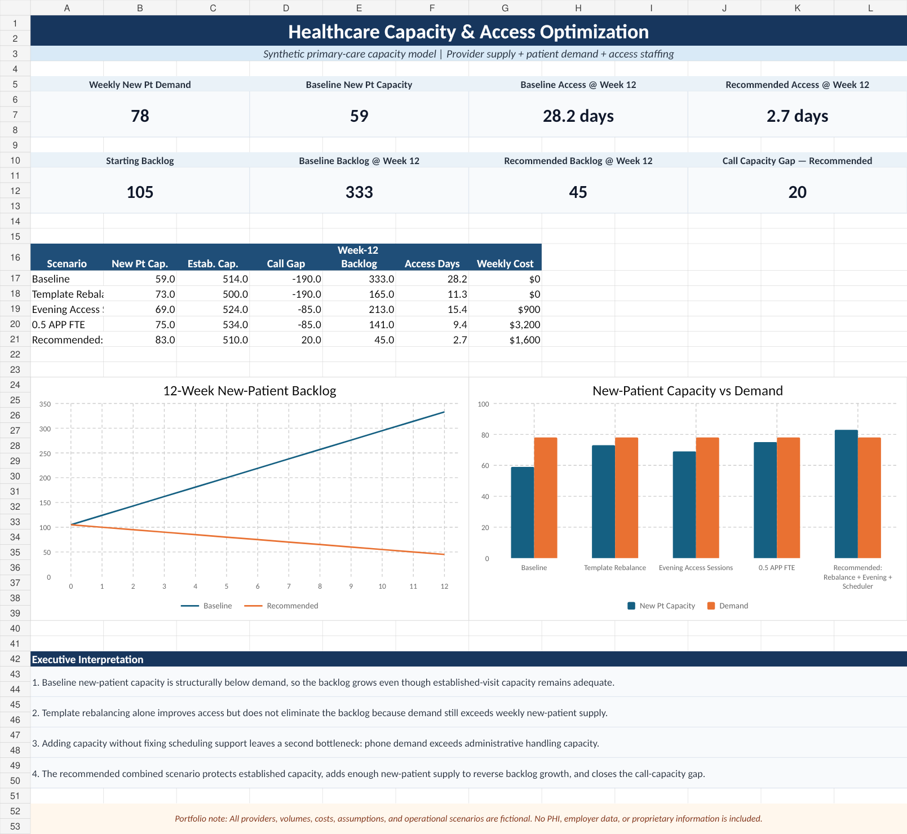

# Healthcare Capacity & Access Optimization Case Study

## Executive Overview

This portfolio case study models a fictional primary-care practice experiencing worsening new-patient access despite strong provider utilization and adequate established-patient capacity.

The project demonstrates how an operations leader can combine provider template supply, patient demand, backlog, scheduling workload, and scenario modeling to determine which operational changes are most likely to improve access without creating a new constraint elsewhere in the system.

## Dashboard Preview

## Business Problem

The practice receives approximately **78 new-patient requests per week** but has only **59 dedicated new-patient appointment slots**. At the same time, the scheduling team receives approximately **1,450 patient calls per week**, exceeding modeled administrative handling capacity.

This creates two related bottlenecks:

- insufficient new-patient appointment supply;
- insufficient scheduling capacity to absorb patient demand efficiently.

The result is a growing new-patient backlog even though total provider capacity is not uniformly constrained.

## Questions Addressed

- Is the access problem caused by total provider capacity or by how capacity is allocated?
- Can templates be rebalanced without materially harming established-patient access?
- Would evening sessions or additional APP capacity improve the problem?
- Does scheduling staffing need to change alongside provider capacity?
- Which scenario reduces backlog while preserving operational sustainability?

## Model Components

The case study includes:

- provider-level clinical capacity;
- template utilization and no-show assumptions;
- new-patient and established-patient demand;
- scheduling call-volume capacity;
- five operating scenarios;
- a 12-week backlog projection;
- projected access days;
- an executive dashboard and operational recommendations.

## Scenarios Modeled

1. Baseline
2. Template rebalance
3. Evening access sessions
4. Addition of 0.5 APP FTE
5. Recommended combined scenario: template rebalance + evening access + 0.5 scheduling FTE

## Core Finding

The modeled access problem is not solved by increasing productivity alone. The practice needs to address both **appointment allocation** and **administrative access capacity**.

The recommended scenario adds enough new-patient supply to reverse backlog growth while maintaining established-patient capacity above modeled demand and bringing scheduling capacity close to weekly call volume.

## Skills Demonstrated

- Ambulatory capacity planning
- Provider template analysis
- Patient access strategy
- Demand and backlog modeling
- Scenario analysis
- Staffing analysis
- Operational finance
- KPI development
- Executive reporting
- Data-driven decision support

## Project Files

- `capacity-access-optimization-model.xlsx` — editable capacity and scenario model
- `capacity-access-dashboard-preview.png` — executive dashboard preview
- `sample-provider-capacity.csv` — synthetic provider capacity data
- `metric-definitions.md` — model definitions and interpretation guidance
- `operational-analysis.md` — findings and leadership recommendations

## Data & Confidentiality

All providers, volumes, costs, staffing assumptions, scenarios, and data used in this project are fictional and were created solely for professional portfolio demonstration.

No patient information, protected health information, employer data, or proprietary organizational information is included.
